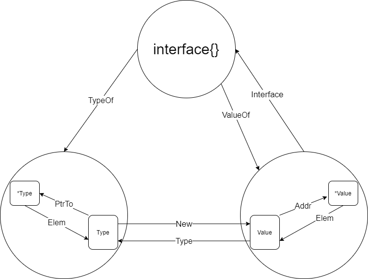

# 运行时反射

在计算机学中，反射式编程`reflective programming`或反射`reflection`是指计算机程序在运行时可以访问,检测和修改它本身状态或行为的一种能力.比喻来说,反射就是程序在运行的时候能够“观察”并且修改自己的行为。

python是解释型语言,只有导入时和运行时,我们可以很轻易的边执行边观察对象,运行时反射是自带的;但golang不同,它是编译型语言,源码中我们确定的类型,赋值在编译完后运行时程序自身是无法知道的,而有些行为的处理我们只能在运行时才能做.这就好比我们定了一个计划,我们可以按部就班的完成,但外部忽然来了个计划中没有的变化,那我们就只能随机应变了.go语言的'随机应变'的能力就是靠运行时反射实现的.

在介绍运行时反射前,我们现来看下golang的`interface{}`

## `interface{}`

一般我们将`interface{}`理解为any,也就是它可以表示一切类型的一切对象,因此在定义异构map结构时我们会强行将其定义为`map[string]interface{}`类型,然后取出值后再使用强制转换将它转换为原来的类型.这种用法告诉我们,实际上`interface{}`是包含数据的元信息的,因此它才能在强制转换类型后值不变.

### 类型检查

如何处理`interface{}`是一件麻烦的事情,因为`interface{}`类型本身一点用都没有,它必须转成有实际含义的类型才能起到作用,因此判断它究竟是什么类型就是处理`interface{}`的头一步.

golang中使用`Type Switches`语句实现:

```golang
switch a.(type) {
case string:
    {
       ....
    }
case float64:
    {
        ...
    }
...
}

```

实际上这种类型检查也可以在运行时使用,而且已经可以解决大部分问题,很多时候我们解析一些未规范过的json时就大量使用这一技术

## 标准库`reflect`

golang提供了标准库`reflect`用于实现完整的运行时反射能力,它也是利用`interface{}`的特性.

一个变量值得我们关注的无非是两部分:

+ 一个是类型,变量的类型决定了有哪些字段,支持哪些方法集
+ 一个是它存的值,变量的值除了一定包含类型信息外,还会有这个类型的值保存,这样这个变量才可用.

因此`reflect`也是提供了两个对应的interface以及由一个变量转化为满足这两个interface类型的方法:

+ `reflect.TypeOf(i interface{}) reflect.Type`,用于从变量中提取类型信息
+ `reflect.ValueOf(i interface{}) reflect.Value`,用于从变量中提取值信息

下面是golang中使用反射时的对象和其关系图



我们要反射的对象如果是值则对应图中的`Type`和`Value`,如果是指针则对应图中的`*Type`和`*Value`, 那在对这个对象一无所知的情况下怎么判断呢?

可以通过`Type`接口的方法`.Kind()`来确定,`reflect.Ptr`表示为结构体的指针,`xxx*`一般表示某种基础类型的指针

### Type

Type描述变量的类型,它提供了如下通用方法

```golang
// Type 是 Go 类型的表示。
//
// 并非所有方法都适用于所有类型。
// 在调用 kind 具体方法之前，先使用 Kind 方法找出类型的种类。因为调用一个方法如果类型不匹配会导致 panic
//
// Type 类型值是可以比较的，比如用 == 操作符。所以它可以用做 map 的 key
// 如果两个 Type 值代表相同的类型，那么它们一定是相等的。
type Type interface {
    
    // Align 返回该类型在内存中分配时，以字节数为单位的字节数
    Align() int
    
    // FieldAlign 返回该类型在结构中作为字段使用时，以字节数为单位的字节数
    FieldAlign() int
    
    // Method 这个方法返回类型方法集中的第 i 个方法。
    // 如果 i 不在[0, NumMethod()]范围内，就会 panic。
    // 对于一个非接口类型 T 或 *T，返回的 Method 的 Type 和 Func。
    // fields 字段描述一个函数，它的第一个参数是接收方，而且只有导出的方法可以访问。
    // 对于一个接口类型，返回的 Method 的 Type 字段给出的是方法签名，没有接收者，Func字段为nil。
    // 方法是按字典序顺序排列的。
    Method(int) Method
    
    // MethodByName 返回类型中带有该名称的方法。
    // 方法集和一个表示是否找到该方法的布尔值。
    // 对于一个非接口类型 T 或 *T，返回的 Method 的 Type 和 Func。
    // fields 字段描述一个函数，其第一个参数是接收方。
    // 对于一个接口类型，返回的 Method 的 Type 字段给出的是方法签名，没有接收者，Func字段为nil。
    MethodByName(string) (Method, bool)

    // NumMethod 返回使用 Method 可以访问的方法数量。
    // 请注意，NumMethod 只在接口类型的调用的时候，会对未导出方法进行计数。
    NumMethod() int

    // 对于定义的类型，Name 返回其包中的类型名称。
    // 对于其他(非定义的)类型，它返回空字符串。
    Name() string

    // PkgPath 返回一个定义类型的包的路径，也就是导入路径，导入路径是唯一标识包的类型，如 "encoding/base64"。
    // 如果类型是预先声明的(string, error)或者没有定义(*T, struct{}, []int，或 A，其中 A 是一个非定义类型的别名），包的路径将是空字符串。
    PkgPath() string

    // Size 返回存储给定类型的值所需的字节数。它类似于 unsafe.Sizeof.
    Size() uintptr

    // String 返回该类型的字符串表示。
    // 字符串表示法可以使用缩短的包名。
    // (例如，使用 base64 而不是 "encoding/base64")并且它并不能保证类型之间是唯一的。如果是为了测试类型标识，应该直接比较类型 Type。
    String() string

    // Kind 返回该类型的具体种类。
    Kind() Kind

    // Implements 表示该类型是否实现了接口类型 u。
    Implements(u Type) bool

    // AssignableTo 表示该类型的值是否可以分配给类型 u。
    AssignableTo(u Type) bool

    // ConvertibleTo 表示该类型的值是否可转换为 u 类型。
    ConvertibleTo(u Type) bool

    // Comparable 表示该类型的值是否具有可比性。
    Comparable() bool
}
```

同时也为一些特殊类型提供了专用的方法:

| Kind       | Methods applicable                                         |
| ---------- | ---------------------------------------------------------- |
| `Int*`     | Bits                                                       |
| `Uint*`    | Bits                                                       |
| `Float*`   | Bits                                                       |
| `Complex*` | Bits                                                       |
| `Array`    | Elem, Len                                                  |
| `Chan`     | ChanDir, Elem                                              |
| `Func`     | In, NumIn, Out, NumOut, IsVariadic                         |
| `Map`      | Key, Elem                                                  |
| `Ptr`      | Elem                                                       |
| `Slice`    | Elem                                                       |
| `Struct`   | Field, FieldByIndex, FieldByName,FieldByNameFunc, NumField |

对专有方法的说明如下：

```golang
type Type interface {

    // Bits 以 bits 为单位返回类型的大小。
    // 如果类型的 Kind 不属于：sized 或者 unsized Int, Uint, Float, 或者 Complex，会 panic。
    //大小不一的Int、Uint、Float或Complex类型。
    Bits() int

    // ChanDir 返回一个通道类型的方向。
    // 如果类型的 Kind 不是 Chan，会 panic。
    ChanDir() ChanDir


    // IsVariadic 表示一个函数类型的最终输入参数是否为一个 "..." 可变参数。如果是，t.In(t.NumIn() - 1) 返回参数的隐式实际类型 []T.
    // 更具体的，如果 t 代表 func(x int, y ... float64)，那么：
    // t.NumIn() == 2
    // t.In(0)是 "int" 的 reflect.Type 反射类型。
    // t.In(1)是 "[]float64" 的 reflect.Type 反射类型。
    // t.IsVariadic() == true
    // 如果类型的 Kind 不是 Func.IsVariadic，IsVariadic 会 panic
    IsVariadic() bool

    // Elem 返回一个 type 的元素类型。
    // 如果类型的 Kind 不是 Array、Chan、Map、Ptr 或 Slice，就会 panic
    Elem() Type

    // Field 返回一个结构类型的第 i 个字段。
    // 如果类型的 Kind 不是 Struct，就会 panic。
    // 如果 i 不在 [0, NumField()] 范围内，也会 panic。
    Field(i int) StructField

    // FieldByIndex 返回索引序列对应的嵌套字段。它相当于对每一个 index 调用 Field。
    // 如果类型的 Kind 不是 Struct，就会 panic。
    FieldByIndex(index []int) StructField

    // FieldByName 返回给定名称的结构字段和一个表示是否找到该字段的布尔值。
    FieldByName(name string) (StructField, bool)

    // FieldByNameFunc 返回一个能满足 match 函数的带有名称的 field 字段。布尔值表示是否找到。
    // FieldByNameFunc 先在自己的结构体的字段里面查找，然后在任何嵌入结构中的字段中查找，按广度第一顺序搜索。最终停止在含有一个或多个能满足 match 函数的结构体中。如果在该深度上满足条件的有多个字段，这些字段相互取消，并且 FieldByNameFunc 返回没有匹配。
    // 这种行为反映了 Go 在包含嵌入式字段的结构的情况下对名称查找的处理方式
    FieldByNameFunc(match func(string) bool) (StructField, bool)

    // In 返回函数类型的第 i 个输入参数的类型。
    // 如果类型的 Kind 不是 Func 类型会 panic。
    // 如果 i 不在 [0, NumIn()) 的范围内，会 panic。
    In(i int) Type

    // Key 返回一个 map 类型的 key 类型。
    // 如果类型的 Kind 不是 Map，会 panic。
    Key() Type

    // Len 返回一个数组类型的长度。
    // 如果类型的 Kind 不是 Array，会 panic。
    Len() int

    // NumField 返回一个结构类型的字段数目。
    // 如果类型的 Kind 不是 Struct，会 panic。
    NumField() int

    // NumIn 返回一个函数类型的输入参数数。
    // 如果类型的 Kind 不是Func.NumIn()，会 panic。
    NumIn() int

    // NumOut 返回一个函数类型的输出参数数。
    // 如果类型的 Kind 不是 Func.NumOut()，会 panic。
    NumOut() int

    // Out 返回一个函数类型的第 i 个输出参数的类型。
    // 如果类型的类型不是 Func.Out，会 panic。
    // 如果 i 不在 [0, NumOut()) 的范围内，会 panic。
    Out(i int) Type

    common() *rtype
    uncommon() *uncommonType
}
```

## Value

Value维护对象的值,通常它的接口根据类型不同会有不同.需要注意的是`ValueOf`传进去的是拷贝,因此如果传进去的是实例则生成的Value被赋值也无法

## 针对结构体的反射操作

反射最常见的应用场景在于反射结构体,很多库orm库,序列化库都是基于这个实现.下面我们用下面的例子来介绍:

```golang
type Btype struct {
    C int    `mytags:"c"`
    d string `mytags:"d"`
}

func (a *Btype) CallB(name string) {
    fmt.Println("called", name)
}

type Atype struct {
    A int    `mytags:"a"`
    b string `mytags:"b"`
    *Btype
}

func (a *Atype) CallA(name string) {
    fmt.Println("called", name)
}
```

### 获取结构体的信息

要获得结构体的信息我们必须拿到的Type是结构体而不是指针,因此看上面的图,我们通过`.Elem`将其转换.

要获取字段信息,我们需要使用`Type.Field(i int) reflect.StructField`,这个`i`是字段的索引,由定时结构体时的顺序决定;
与之类似的是获得方法信息,也是使用的`Type.Method(i int) reflect.Method`.

如果要遍历这个结构体,我们可以用`Type.NumField() int`或者`Type.NumMethod() int`获取索引长度.然后又for循环一个一个的取出.

为了方便后续使用,建议将取到的field和method放到字典中以方便后续调用.

```golang
test := Atype{
    A: 10,
    b: "abc",
    Btype: &Btype{
        C: 11,
        d: "def",
    },
}
vp := reflect.ValueOf(&test)
// 首先获得的是指针类型
tpk := vp.Kind()
fmt.Println(tpk) //ptr
// 经过转换获得的类型为结构体
v := vp.Elem()
tk := v.Kind()
fmt.Println(tk) //struct
// 获取指针对应的结构体类型名
t := v.Type()
fmt.Println(t.Name()) //Atype
// 查看结构体的字段结构
fieldmap := map[string]reflect.StructField{}
for i := 0; i < t.NumField(); i++ {
    field := t.Field(i)
    fmt.Println("---field---")
    fmt.Println(field.Name)      //字段名: A b Btype 
    fmt.Println(field.Type)      //字段类型: int string *main.Btype
    fmt.Println(field.Tag)       //字段标签字符串: mytags:"a"  mytags:"b"
    fmt.Println(field.Anonymous) //字段是否是匿名字段: false false true
    fmt.Println(field.Index)     //字段索引:[0] [1] [2]
    fmt.Println(field.Offset)    //字段在内存中偏移量:0 8 24
    fieldmap[field.Name] = field
}
// 查看结构体的方法集合
methodmap := map[string]reflect.Method{}
for i := 0; i < t.NumMethod(); i++ {
    method := t.Method(i)
    fmt.Println("---method---")
    fmt.Println(method.Name)  //方法名:CallB
    fmt.Println(method.Type)  //方法签名:func(main.Atype, string)
    fmt.Println(method.Index) //方法索引:0
    methodmap[method.Name] = method
}
```

可以看出反射只能反射出第一层,但可以通过`field.Anonymous`看出字段是否为字段为匿名字段

#### 结构体的标签字符串

我们在使用json时时长会像上面例子中一样给字段用`\``添加标签字符串,这也是很多orm的常规用法.实际上这些标签字符串也就是使用反射获取后解析的.

通常惯例上我们用`tag1:"attr1=value1,attr2=value2" tag2:"attr1=value1,attr2=value2" ...`这种形式分隔标签

### 使用反射创建结构体实例

构造实例的方法又两个:

+ `reflect.New(Type)`,用于构造指向结构体的零值实例的指针
+ `reflect.Zero(Type)`,用于构造指向结构体的零值实例

但无论如何他们构造出来的都是一个`Value`,我们需要用`Value.Interface()`将其转换回`interface{}`,然后再强制转化为对应的类型

```golang
// 创建结构体实例
//创建指定类型的零值实例的指针的Value
fmt.Println("---new p instance---")
newvp := reflect.New(t)
fmt.Println(newvp.Interface().(*Atype))

fmt.Println("---new instance---")
newv := reflect.Zero(t)
fmt.Println(newv.Interface().(Atype))
```

### 获取和重置结构体实例字段的值

注意即便是使用运行时反射,结构体中的私有字段依然是私有的,也就是无法修改无法读取.那怎么判断某个字段是否私有呢?判断field的名字首字母是否大写即可.

如果一个字段是公开的,那么我们直接使用`Value.Field(i)`获取这个字段的值的`Value`就行,要读出来就用`Value.Interface()`将其转化为`interface{}`,要重置就用`Value.Set(Value)`用一个新值的Value为其赋值即可

```golang
// 查看结构体实例的字段并重置字段为0值
for i := 0; i < t.NumField(); i++ {
    field := t.Field(i)
    fieldValue := v.Field(i)
    fmt.Println("---field---")
    fmt.Println(field.Name)      // A b Btype
    fmt.Println(field.Type)      //int string *main.Btype
    fmt.Println(field.Tag)       //mytags:"a"  mytags:"b"
    fmt.Println(field.Anonymous) //false false true
    fmt.Println(field.Index)     //[0] [1] [2]
    fmt.Println(field.Offset)    //0 8 24
    // 首字母小写表示是私有字段,Value只能针对公开字段获取和赋值
    if unicode.IsUpper([]rune(field.Name)[0]) {
        fmt.Println("---field value---")
        fmt.Println(fieldValue.Interface())
        fmt.Println("---field value reset to zero---")
        zeroValue := reflect.Zero(fieldValue.Type())
        fieldValue.Set(zeroValue)
    }
}
```

### 调用结构体的方法

和获取结构体实例字段的值类似,我们也是一样的方法获得到实例绑定方法的Value,然后调用方法类型Value的特殊方法`Call(in []reflect.Value) []reflect.Value`来调用方法.
需要注意,入参和返回值类型都是`[]reflect.Value`,因此获得的结果还需要进一步调用`Interface()`后变成正常的值

```golang
// 调用实例的方法
for i := 0; i < t.NumMethod(); i++ {
    method := t.Method(i)
    methodValue := v.Method(i)
    fmt.Println("---method---")
    fmt.Println(method.Name)  //CallB
    fmt.Println(method.Type)  //func(main.Atype, string)
    fmt.Println(method.Index) //0
    fmt.Println("---call method---")
    methodValue.Call([]reflect.Value{
        reflect.ValueOf("hello"),
    })
}
```

## 代价

运行时反射在带来灵活性的同时带来的是性能降低,以创建结构体实例为例,使用反射比正常new慢1.5左右,使用反射给实例赋值比正常赋值慢100-1000倍.因此能不用反射就别用.

至于输入数据的规范性问题带来的兼容性问题,更加建议通过规范化数据,人员充分培训等项目管理手段以及严格的数据校验和版本管理来解决.
